# TortureU

**Load testing tells you it got slow. TortureU tells you which dependency did it.**

One CLI that drives load and fault injection on the same clock **against a local
`docker-compose` stack — no Kubernetes** — and returns a single verdict naming what broke and why.

<p align="center">
  
</p>

*Real output, not a mockup — every line above is captured from
[`evals/corpus/case1-no-timeout`](evals/corpus), and a test renders the same verdict to keep it
that way. [`What comes back`](#what-comes-back) explains each line, including what it refuses to
claim. On a stack with OpenTelemetry the same run returns `caused` plus the per-hop chain.*

```sh
git clone https://github.com/jdb316/tortureu && cd tortureu/examples/quickstart
tortureu run          # a real verdict on a deliberately broken service — Docker only, no k6 needed
```

Or point it at your own stack: `tortureu init && tortureu run` — ~17s to a first verdict on a repo
it has never seen. See [`examples/quickstart`](examples/quickstart).

> **Status: alpha.** The core works and is proven against real Docker: load and faults on one
> clock, topological egress isolation, fault interception on internal dependencies, and a verdict
> that names the causing fault. All ten verbs are real — `init`, `run`, `doctor`, `smoke`,
> `check`, `emit`, `capture`, `replay`, `trend` — and `mcp` speaks JSON-RPC 2.0 over stdio.
> Every one of the 155 tools in [`registry.yaml`](registry.yaml) is reachable from the CLI, so no
> entry tells you to run something that does not work.
>
> **Not yet:** no tag has been pushed, so no release archive or image exists to install from —
> until one does, the pipeline `init --ci` writes fails its install step with exit `2` and names
> the routes rather than downloading a URL that 404s.
>
> **What the evidence actually shows.** On the labelled corpus (`make eval`, results in
> [`BENCHMARKS.md`](BENCHMARKS.md)) TortureU detects **8/8** planted defects and reports **0
> findings on the control**. It names the causing fault in **5 of 5** findings from runs that
> injected a fault — including a two-fault run, where traces identify which dependency actually
> degraded. Three corpus cases inject **no** fault at all (static defects under load); those
> findings stay `ambiguous`, because with nothing injected there is no cause to name and inventing
> one would be the whole failure mode this tool exists to avoid. Over every finding regardless,
> that is 5/9. `caused` needs traces: without OpenTelemetry a verdict tops out at `correlated`.
> See [`SPEC.md` §12](SPEC.md) for the rest of what is deliberately open.

## Install

The zero-infrastructure route — needs a Go toolchain and nothing else:

```bash
go install github.com/jdb316/tortureu/cmd/tortureu@latest   # pin to @v0.1.0 once tagged
```

Before the first tag, `@latest` resolves to a pseudo-version of the default branch — it works as
soon as the repo is public, which is why this is the route that needs no infrastructure at all. It
is deliberately *not* what CI uses: it needs a Go toolchain on the runner and pins nothing a
checksum could verify.

Two more routes exist once a tag is pushed: the release archive for your platform
(`tortureu_<version>_<os>_<arch>.tar.gz`, verified against that release's `checksums.txt`) and the
CI job image `ghcr.io/jdb316/tortureu:<tag>`, which carries the Docker CLI so the container can
drive your compose stack. `.goreleaser.yaml` and `Dockerfile` build both; `.github/workflows/release.yml`
runs them on a `v*` tag. **No tag has been pushed yet, so none of those URLs resolve today.**

k6 is not bundled. It is AGPL-3 and TortureU is MIT, so TortureU drives it as a separate,
unmodified process and never links it (`SPEC.md` §10) — install k6 yourself.

For CI, `tortureu init --ci [github|gitlab]` writes a pipeline that installs a **pinned** release —
never `latest`, because a harness that updates itself under your pipeline makes every regression
ambiguous. While no release exists, that install step fails the job with exit `2` and prints the
routes above; a red build for a stated reason beats a green one that ran no experiment.

## The problem

Your load test ramps to 5k rps and passes. Then production degrades because Postgres got 300 ms
slower, a 20-connection pool drained, retries with no backoff tripled the load, and p99 went to 4
seconds. No load generator shows you that, because none of them can make Postgres slow *while*
generating load.

Chaos tools can inject the fault — but they need Kubernetes. Grafana's own `xk6-disruptor` puts
fault injection inside a k6 test, on k6's clock, which is the right idea — and it targets
Kubernetes Pods and Services. Chaos Mesh, Litmus and Testkube need a cluster too. Toxiproxy runs
anywhere but has no scheduler, so you drive it by hand.

| | load + fault on one clock | runs without Kubernetes | names the causing dependency |
|---|---|---|---|
| **TortureU** | yes | yes | yes |
| Grafana `xk6-disruptor` | yes | **no** — `PodDisruptor` / `ServiceDisruptor` only | no |
| Chaos Mesh · Litmus · Testkube | no load generator | **no** | no |
| Toxiproxy | no scheduler — you drive it by hand | yes | no |
| k6 · Vegeta · Gatling alone | no fault injection | yes | no |

*Checked against the `grafana/xk6-disruptor` repository on 2026-08-10: it exposes `PodDisruptor` and
`ServiceDisruptor`, and no file in it mentions docker-compose. It is alpha and pre-v1, so this is a
snapshot, not a permanent claim — the "one clock" idea is Grafana's too, and the part that is ours
is doing it without a cluster.*

Nothing lets you say this against a compose file on a laptop:

```yaml
load:
  stages:
    - { phase: peak, hold: 500rps, for: 180s }
faults:
  - { at: peak, target: postgres:5432, inject: { latency: 300ms } }
assert:
  - http_req_duration: ["p(99)<1500"]
```

## What comes back

```
FAIL  checkout-spike  280s

  ✗ http_req_duration: p(95)<500 -> 4218ms
    caused by  pg_slow (postgres:5432)  [confidence: correlated]

    look at:  github.com/jackc/pgx/v5 MaxConns, MinConns, ConnConfig.ConnectTimeout

  ✓ http_req_failed: rate<0.01     0.003

  egress: 1 mocked, 1 blocked, 0 real, 0 unclassified          exit 1
```

That is the real output format, and its limits are visible in it:

- **`correlated`, not `caused` — because this repo has no tracing.** Attribution here is by fault
  window: one fault was active when the assertion broke. With OpenTelemetry present, TortureU
  reads the spans and returns `caused` plus the per-hop chain instead — the same run against an
  instrumented stack produces `postgres:5432 latency 4ms -> 304ms` → `pgx.acquire` →
  `POST /checkout` → `gateway`. Without spans it stays at `correlated` and shows no chain, because
  a chain that was not measured would have to be invented.
- **`sql:` and `promql:` asserts need an endpoint.** `sql:` asserts are evaluated against
  PostgreSQL and MySQL when `-sql-url` is given (a `sql:` expression is a violation *count* — the
  invariant holds iff it returns `0`); `promql:` needs `-prom-url`. Without one, they read
  `not evaluated` — and an assert that was not evaluated is never reported as passing, so a run
  whose asserts were all unevaluated exits `4` (inconclusive), never `0`.

Measured values (`4218ms`, `0.003`) come from k6's own summary; where a value genuinely cannot be
read it says `not measured`, which is deliberately distinct from `not evaluated`.

What it does give you is the *candidate config surface* — library plus knob names, never a
`file:line`. Finding the exact constant is the job of whoever, or whatever, reads this.

## Design

| Document | What it is |
|---|---|
| [`SPEC.md`](SPEC.md) | normative. 148 numbered requirements. Build against this. |
| [`RESEARCH.md`](RESEARCH.md) | the survey: 155 tools across 19 domains, and why each is driven, delegated or merely named |
| [`VERDICT.md`](VERDICT.md) | verdict schema, exit codes, MCP surface |
| [`BENCHMARKS.md`](BENCHMARKS.md) | how this gets evaluated, and what we refuse to claim |
| [`registry.yaml`](registry.yaml) | the tool catalog |
| [`PLAN.md`](PLAN.md) | the original build plan; historical, and says where its scope was exceeded |
| [`CONTRIBUTING.md`](CONTRIBUTING.md) | **read before your first PR** — spec-first, failing-test-first, and the rule against claiming verification you did not perform |

Two constraints are load-bearing and worth reading before contributing (see
[`CONTRIBUTING.md`](CONTRIBUTING.md) for the rest, including the gate your PR must pass):

- **Egress denies by default.** An unclassified external host aborts the run. A 100× replay against
  someone's real API is an outage you cause them.
- **We don't compete with k6's vocabulary.** TortureU's nouns are `experiment`, `fault`, `slo`,
  `verdict`. k6 owns `script`, `test`, `threshold`. Both MCPs coexist.

## Development

```bash
go test ./...      # unit tests
python3 check.py   # spec/docs/registry consistency + requirement traceability
```

Spec-driven and test-driven: state the requirement in `SPEC.md` first, write a test citing its id,
watch it fail, then implement. `check.py` fails on a test citing a requirement that doesn't exist.

## Licence

MIT. TortureU invokes k6 (AGPL-3.0) as a separate, unmodified process and never links against it —
see `SPEC.md` §10.
